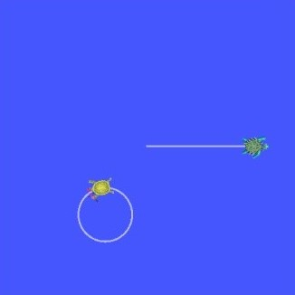

.. _UsingStampedDatatypesWithTf2RosMessageFilter:

Using stamped datatypes with tf2_ros::MessageFilter
===================================================

**Goal:** Learn how to use ``tf2_ros::MessageFilter`` to process stamped datatypes.

**Tutorial level:** Advanced

**Time:** 10 minutes

.. contents:: Contents
   :depth: 3
   :local:

Background
----------

This tutorial explains how to use sensor data with tf2. Some real-world examples of sensor data are:

    * cameras, both mono and stereo

    * laser scans

Suppose that a new turtle named ``turtle3`` is created and it doesn't have good odometry, but there is an overhead camera tracking its position and publishing it as a ``PointStamped`` message in relation to the ``world`` frame.

``turtle1`` wants to know where ``turtle3`` is compared to itself.

To do this ``turtle1`` must listen to the topic where ``turtle3``'s pose is being published, wait until transforms into the desired frame are ready, and then do its operations.
To make this easier the ``tf2_ros::MessageFilter`` is very useful.
The ``tf2_ros::MessageFilter`` will take a subscription to any ROS 2 message with a header and cache it until it is possible to transform it into the target frame.

Setting up the example
----------------------

1 Write the broadcaster node of PointStamped messages
^^^^^^^^^^^^^^^^^^^^^^^^^^^^^^^^^^^^^^^^^^^^^^^^^^^^^

For this tutorial we will set up a demo application which has a node (in Python) to broadcast the ``PointStamped`` position messages of ``turtle3``.

First, let's create the source file.

Go to the ``learning_tf2_py`` :ref:`package <WritingATf2StaticBroadcasterPy>` we created in the previous tutorial.
Inside the ``src/learning_tf2_py/learning_tf2_py`` directory download the example sensor message broadcaster code by entering the following command:

.. tabs::

  .. group-tab:: Linux

    .. code-block:: console

       wget https://raw.githubusercontent.com/ros/geometry_tutorials/ros2/turtle_tf2_py/turtle_tf2_py/turtle_tf2_message_broadcaster.py

  .. group-tab:: macOS

    .. code-block:: console

       wget https://raw.githubusercontent.com/ros/geometry_tutorials/ros2/turtle_tf2_py/turtle_tf2_py/turtle_tf2_message_broadcaster.py

  .. group-tab:: Windows

    In a Windows command line prompt:

    .. code-block:: console

       curl -sk https://raw.githubusercontent.com/ros/geometry_tutorials/ros2/turtle_tf2_py/turtle_tf2_py/turtle_tf2_message_broadcaster.py -o turtle_tf2_message_broadcaster.py

    Or in powershell:

    .. code-block:: console

       curl https://raw.githubusercontent.com/ros/geometry_tutorials/ros2/turtle_tf2_py/turtle_tf2_py/turtle_tf2_message_broadcaster.py -o turtle_tf2_message_broadcaster.py

Open the file using your preferred text editor.

.. code-block:: python

   from geometry_msgs.msg import PointStamped
   from geometry_msgs.msg import Twist

   import rclpy
   from rclpy.node import Node

   from turtlesim.msg import Pose
   from turtlesim.srv import Spawn

   class PointPublisher(Node):

       def __init__(self):
           super().__init__('turtle_tf2_message_broadcaster')

           # Create a client to spawn a turtle
           self.spawner = self.create_client(Spawn, 'spawn')
           # Boolean values to store the information
           # if the service for spawning turtle is available
           self.turtle_spawning_service_ready = False
           # if the turtle was successfully spawned
           self.turtle_spawned = False
           # if the topics of turtle3 can be subscribed
           self.turtle_pose_cansubscribe = False

           self.timer = self.create_timer(1.0, self.on_timer)

       def on_timer(self):
           if self.turtle_spawning_service_ready:
               if self.turtle_spawned:
                   self.turtle_pose_cansubscribe = True
               else:
                   if self.result.done():
                       self.get_logger().info(
                           f'Successfully spawned {self.result.result().name}')
                       self.turtle_spawned = True
                   else:
                       self.get_logger().info('Spawn is not finished')
           else:
               if self.spawner.service_is_ready():
                   # Initialize request with turtle name and coordinates
                   # Note that x, y and theta are defined as floats in turtlesim/srv/Spawn
                   request = Spawn.Request()
                   request.name = 'turtle3'
                   request.x = float(4)
                   request.y = float(2)
                   request.theta = float(0)
                   # Call request
                   self.result = self.spawner.call_async(request)
                   self.turtle_spawning_service_ready = True
               else:
                   # Check if the service is ready
                   self.get_logger().info('Service is not ready')

           if self.turtle_pose_cansubscribe:
               self.vel_pub = self.create_publisher(Twist, 'turtle3/cmd_vel', 10)
               self.sub = self.create_subscription(Pose, 'turtle3/pose', self.handle_turtle_pose, 10)
               self.pub = self.create_publisher(PointStamped, 'turtle3/turtle_point_stamped', 10)

       def handle_turtle_pose(self, msg):
           vel_msg = Twist()
           vel_msg.linear.x = 1.0
           vel_msg.angular.z = 1.0
           self.vel_pub.publish(vel_msg)

           ps = PointStamped()
           ps.header.stamp = self.get_clock().now().to_msg()
           ps.header.frame_id = 'world'
           ps.point.x = msg.x
           ps.point.y = msg.y
           ps.point.z = 0.0
           self.pub.publish(ps)

   def main():
       rclpy.init()
       node = PointPublisher()
       try:
           rclpy.spin(node)
       except KeyboardInterrupt:
           pass

       rclpy.shutdown()

1.1 Examine the code
~~~~~~~~~~~~~~~~~~~~

Now let's take a look at the code.
First, in the ``on_timer`` callback function, we spawn the ``turtle3`` by asynchronously calling the ``Spawn`` service of ``turtlesim``, and initialize its position at (4, 2, 0), when the turtle spawning service is ready.

.. code-block:: python

   # Initialize request with turtle name and coordinates
   # Note that x, y and theta are defined as floats in turtlesim/srv/Spawn
   request = Spawn.Request()
   request.name = 'turtle3'
   request.x = float(4)
   request.y = float(2)
   request.theta = float(0)
   Call request
   self.result = self.spawner.call_async(request)

Afterward, the node publishes the topic ``turtle3/cmd_vel``, topic ``turtle3/turtle_point_stamped``, and subscribes to topic ``turtle3/pose`` and runs callback function ``handle_turtle_pose`` on every incoming message.

.. code-block:: python

   self.vel_pub = self.create_publisher(Twist, '/turtle3/cmd_vel', 10)
   self.sub = self.create_subscription(Pose, '/turtle3/pose', self.handle_turtle_pose, 10)
   self.pub = self.create_publisher(PointStamped, '/turtle3/turtle_point_stamped', 10)

Finally, in the callback function ``handle_turtle_pose``, we initialize the ``Twist`` messages of ``turtle3`` and publish them, which will make the ``turtle3`` move along a circle.
Then we fill up the ``PointStamped`` messages of ``turtle3`` with incoming ``Pose`` messages and publish them.

.. code-block:: python

   vel_msg = Twist()
   vel_msg.linear.x = 1.0
   vel_msg.angular.z = 1.0
   self.vel_pub.publish(vel_msg)

   ps = PointStamped()
   ps.header.stamp = self.get_clock().now().to_msg()
   ps.header.frame_id = 'world'
   ps.point.x = msg.x
   ps.point.y = msg.y
   ps.point.z = 0.0
   self.pub.publish(ps)

1.2 Write the launch file
~~~~~~~~~~~~~~~~~~~~~~~~~

In order to run this demo, we need to create a launch file ``turtle_tf2_sensor_message.launch.py`` in the ``launch`` subdirectory of package ``learning_tf2_py``:

.. code-block:: python

   from launch import LaunchDescription
   from launch.actions import DeclareLaunchArgument
   from launch_ros.actions import Node

   def generate_launch_description():
       return LaunchDescription([
           DeclareLaunchArgument(
               'target_frame', default_value='turtle1',
               description='Target frame name.'
           ),
           Node(
               package='turtlesim',
               executable='turtlesim_node',
               name='sim',
               output='screen'
           ),
           Node(
               package='turtle_tf2_py',
               executable='turtle_tf2_broadcaster',
               name='broadcaster1',
               parameters=[
                   {'turtlename': 'turtle1'}
               ]
           ),
           Node(
               package='turtle_tf2_py',
               executable='turtle_tf2_broadcaster',
               name='broadcaster2',
               parameters=[
                   {'turtlename': 'turtle3'}
               ]
           ),
           Node(
               package='turtle_tf2_py',
               executable='turtle_tf2_message_broadcaster',
               name='message_broadcaster',
           ),
       ])

1.3 Add an entry point and build the pakcage
~~~~~~~~~~~~~~~~~~~~~~~~~~~~~~~~~~~~~~~~~~~~

Don't forget to add the executable in the ``setup.py`` file of the package:

.. code-block:: python

   'console_scripts': [
       ...
       'turtle_tf2_message_broadcaster = learning_tf2_py.turtle_tf2_message_broadcaster:main',
   ],

And then we can build the package:

.. tabs::

  .. group-tab:: Linux

    .. code-block:: console

       colcon build --packages-select learning_tf2_py

  .. group-tab:: macOS

    .. code-block:: console

       colcon build --packages-select learning_tf2_py

  .. group-tab:: Windows

    .. code-block:: console

       colcon build --merge-install --packages-select learning_tf2_py

2 Writing the message filter/listener node
^^^^^^^^^^^^^^^^^^^^^^^^^^^^^^^^^^^^^^^^^^

Now, to get the streaming ``PointStamped`` data of ``turtle3`` in the frame of ``turtle1`` reliably, we will create the source file of the message filter/listener node.

Go to the ``learning_tf2_cpp`` :ref:`package <WritingATf2StaticBroadcasterCpp>` we created in the previous tutorial.
Inside the ``src/learning_tf2_cpp/src`` directory download file ``turtle_tf2_message_filter.cpp`` by entering the following command:

.. tabs::

  .. group-tab:: Linux

    .. code-block:: console

       wget https://raw.githubusercontent.com/ros/geometry_tutorials/ros2/turtle_tf2_cpp/src/turtle_tf2_message_filter.cpp

  .. group-tab:: macOS

    .. code-block:: console

       wget https://raw.githubusercontent.com/ros/geometry_tutorials/ros2/turtle_tf2_cpp/src/turtle_tf2_message_filter.cpp

  .. group-tab:: Windows

    In a Windows command line prompt:

    .. code-block:: console

       curl -sk wget https://raw.githubusercontent.com/ros/geometry_tutorials/ros2/turtle_tf2_cpp/src/turtle_tf2_message_filter.cpp -o turtle_tf2_message_filter.cpp

    Or in powershell:

    .. code-block:: console

       curl https://raw.githubusercontent.com/ros/geometry_tutorials/ros2/turtle_tf2_cpp/src/turtle_tf2_message_filter.cpp -o turtle_tf2_message_filter.cpp

Open the file using your preferred text editor.

.. code-block:: C++

   #include <geometry_msgs/msg/point_stamped.hpp>
   #include <message_filters/subscriber.h>

   #include <rclcpp/rclcpp.hpp>
   #include <tf2_ros/buffer.h>
   #include <tf2_ros/create_timer_ros.h>
   #include <tf2_ros/message_filter.h>
   #include <tf2_ros/transform_listener.h>
   #ifdef TF2_CPP_HEADERS
     #include <tf2_geometry_msgs/tf2_geometry_msgs.hpp>
   #else
     #include <tf2_geometry_msgs/tf2_geometry_msgs.h>
   #endif

   #include <chrono>
   #include <memory>
   #include <string>

   using namespace std::chrono_literals;

   class PoseDrawer : public rclcpp::Node
   {
   public:
     PoseDrawer()
     : Node("turtle_tf2_pose_drawer")
     {
       // Declare and acquire `target_frame` parameter
       this->declare_parameter<std::string>("target_frame", "turtle1");
       this->get_parameter("target_frame", target_frame_);

       typedef std::chrono::duration<int> seconds_type;
       seconds_type buffer_timeout(1);

       tf2_buffer_ = std::make_shared<tf2_ros::Buffer>(this->get_clock());
       // Create the timer interface before call to waitForTransform,
       // to avoid a tf2_ros::CreateTimerInterfaceException exception
       auto timer_interface = std::make_shared<tf2_ros::CreateTimerROS>(
         this->get_node_base_interface(),
         this->get_node_timers_interface());
       tf2_buffer_->setCreateTimerInterface(timer_interface);
       tf2_listener_ =
         std::make_shared<tf2_ros::TransformListener>(*tf2_buffer_);

       point_sub_.subscribe(this, "/turtle3/turtle_point_stamped");
       tf2_filter_ = std::make_shared<tf2_ros::MessageFilter<geometry_msgs::msg::PointStamped>>(
         point_sub_, *tf2_buffer_, target_frame_, 100, this->get_node_logging_interface(),
         this->get_node_clock_interface(), buffer_timeout);
       // Register a callback with tf2_ros::MessageFilter to be called when transforms are available
       tf2_filter_->registerCallback(&PoseDrawer::msgCallback, this);
     }

   private:
     void msgCallback(const geometry_msgs::msg::PointStamped::SharedPtr point_ptr)
     {
       geometry_msgs::msg::PointStamped point_out;
       try {
         tf2_buffer_->transform(*point_ptr, point_out, target_frame_);
         RCLCPP_INFO(
           this->get_logger(), "Point of turtle3 in frame of turtle1: x:%f y:%f z:%f\n",
           point_out.point.x,
           point_out.point.y,
           point_out.point.z);
       } catch (tf2::TransformException & ex) {
         RCLCPP_WARN(
           // Print exception which was caught
           this->get_logger(), "Failure %s\n", ex.what());
       }
     }
     std::string target_frame_;
     std::shared_ptr<tf2_ros::Buffer> tf2_buffer_;
     std::shared_ptr<tf2_ros::TransformListener> tf2_listener_;
     message_filters::Subscriber<geometry_msgs::msg::PointStamped> point_sub_;
     std::shared_ptr<tf2_ros::MessageFilter<geometry_msgs::msg::PointStamped>> tf2_filter_;
   };

   int main(int argc, char * argv[])
   {
     rclcpp::init(argc, argv);
     rclcpp::spin(std::make_shared<PoseDrawer>());
     rclcpp::shutdown();
     return 0;
   }

2.1 Examine the code
~~~~~~~~~~~~~~~~~~~~

First, you must include the ``tf2_ros::MessageFilter`` headers from the ``tf2_ros`` package, as well as the previously used ``tf2`` and ``ros2`` related headers.

.. code-block:: C++

   #include <geometry_msgs/msg/point_stamped.hpp>
   #include <message_filters/subscriber.h>

   #include <rclcpp/rclcpp.hpp>
   #include <tf2_ros/buffer.h>
   #include <tf2_ros/create_timer_ros.h>
   #include <tf2_ros/message_filter.h>
   #include <tf2_ros/transform_listener.h>
   #ifdef TF2_CPP_HEADERS
     #include <tf2_geometry_msgs/tf2_geometry_msgs.hpp>
   #else
     #include <tf2_geometry_msgs/tf2_geometry_msgs.h>
   #endif

Second, there needs to be persistent instances of ``tf2_ros::Buffer``, ``tf2_ros::TransformListener`` and ``tf2_ros::MessageFilter``.

.. code-block:: C++

   std::string target_frame_;
   std::shared_ptr<tf2_ros::Buffer> tf2_buffer_;
   std::shared_ptr<tf2_ros::TransformListener> tf2_listener_;
   message_filters::Subscriber<geometry_msgs::msg::PointStamped> point_sub_;
   std::shared_ptr<tf2_ros::MessageFilter<geometry_msgs::msg::PointStamped>> tf2_filter_;

Third, the ROS 2 ``message_filters::Subscriber`` must be initialized with the topic.
And the ``tf2_ros::MessageFilter`` must be initialized with that ``Subscriber`` object.
The other arguments of note in the ``MessageFilter`` constructor are the ``target_frame`` and the callback function.
The target frame is the frame into which it will make sure ``canTransform`` will succeed.
And the callback function is the function that will be called when the data is ready.

.. code-block:: C++

   PoseDrawer()
   : Node("turtle_tf2_pose_drawer")
   {
     // Declare and acquire `target_frame` parameter
     this->declare_parameter<std::string>("target_frame", "turtle1");
     this->get_parameter("target_frame", target_frame_);

     typedef std::chrono::duration<int> seconds_type;
     seconds_type buffer_timeout(1);

     tf2_buffer_ = std::make_shared<tf2_ros::Buffer>(this->get_clock());
     // Create the timer interface before call to waitForTransform,
     // to avoid a tf2_ros::CreateTimerInterfaceException exception
     auto timer_interface = std::make_shared<tf2_ros::CreateTimerROS>(
       this->get_node_base_interface(),
       this->get_node_timers_interface());
     tf2_buffer_->setCreateTimerInterface(timer_interface);
     tf2_listener_ =
       std::make_shared<tf2_ros::TransformListener>(*tf2_buffer_);

     point_sub_.subscribe(this, "/turtle3/turtle_point_stamped");
     tf2_filter_ = std::make_shared<tf2_ros::MessageFilter<geometry_msgs::msg::PointStamped>>(
       point_sub_, *tf2_buffer_, target_frame_, 100, this->get_node_logging_interface(),
       this->get_node_clock_interface(), buffer_timeout);
     // Register a callback with tf2_ros::MessageFilter to be called when transforms are available
     tf2_filter_->registerCallback(&PoseDrawer::msgCallback, this);
   }

And last, the callback method will call ``tf2_buffer_->transform`` when the data is ready and print output to the console.

.. code-block:: C++

   private:
   void msgCallback(const geometry_msgs::msg::PointStamped::SharedPtr point_ptr)
   {
     geometry_msgs::msg::PointStamped point_out;
     try {
       tf2_buffer_->transform(*point_ptr, point_out, target_frame_);
       RCLCPP_INFO(
         this->get_logger(), "Point of turtle3 in frame of turtle1: x:%f y:%f z:%f\n",
         point_out.point.x,
         point_out.point.y,
         point_out.point.z);
     } catch (tf2::TransformException & ex) {
       RCLCPP_WARN(
         // Print exception which was caught
         this->get_logger(), "Failure %s\n", ex.what());
     }
   }

2.2 Build the package
~~~~~~~~~~~~~~~~~~~~~

Before building the package ``learning_tf2_cpp``, please add two another dependencies in the ``package.xml`` file of this package:

.. code-block:: xml

   <depend>message_filters</depend>
   <depend>tf2_geometry_msgs</depend>

And in the ``CMakeLists.txt`` file, add two lines below the existing dependencies:

.. code-block:: console

   find_package(message_filters REQUIRED)
   find_package(tf2_geometry_msgs REQUIRED)

Most importantly, add these lines below the dependencies:

.. code-block:: console

   find_file(TF2_CPP_HEADERS
     NAMES tf2_geometry_msgs.hpp
     PATHS ${tf2_geometry_msgs_INCLUDE_DIRS}
     NO_CACHE
     PATH_SUFFIXES tf2_geometry_msgs
   )

After that, add the executable and name it ``turtle_tf2_message_filter``, which you'll use later with ``ros2 run``.

.. code-block:: console

   add_executable(turtle_tf2_message_filter src/turtle_tf2_message_filter.cpp)
   ament_target_dependencies(
     turtle_tf2_message_filter
     geometry_msgs
     message_filters
     rclcpp
     tf2
     tf2_geometry_msgs
     tf2_ros
   )

Finally, add the ``install(TARGETS…)`` section (below other existing nodes) so ``ros2 run`` can find your executable:

.. code-block:: console

   install(TARGETS
     turtle_tf2_message_filter
     DESTINATION lib/${PROJECT_NAME})

Now open a new terminal, navigate to the root of your workspace, and rebuild the package with command:

.. tabs::

  .. group-tab:: Linux

    .. code-block:: console

       colcon build --packages-select learning_tf2_cpp

  .. group-tab:: macOS

    .. code-block:: console

       colcon build --packages-select learning_tf2_cpp

  .. group-tab:: Windows

    .. code-block:: console

       colcon build --merge-install --packages-select learning_tf2_cpp

Running and results
-------------------

First we need to run several nodes (including the broadcaster node of PointStamped messages) by launching the launch file ``turtle_tf2_sensor_message.launch.py``:

.. code-block:: console

   ros2 launch learning_tf2_py turtle_tf2_sensor_message.launch.py

This will bring up the ``turtlesim`` window with two turtles, where ``turtle3`` is moving along a circle, while ``turtle1`` isn't moving at first.
But you can run the ``turtle_teleop_key`` node in another terminal to drive ``turtle1`` to move:

.. code-block:: console

   ros2 run turtlesim turtle_teleop_key

Now if you echo the topic ``turtle3/turtle_point_stamped``:

.. code-block:: console

   ros2 topic echo /turtle3/turtle_point_stamped

Then there will be output like this:

.. code-block:: console

   header:
     stamp:
       sec: 1629877510
       nanosec: 902607040
     frame_id: world
   point:
     x: 4.989276885986328
     y: 3.073937177658081
     z: 0.0
   ---
   header:
     stamp:
       sec: 1629877510
       nanosec: 918389395
     frame_id: world
   point:
     x: 4.987966060638428
     y: 3.089883327484131
     z: 0.0
   ---
   header:
     stamp:
       sec: 1629877510
       nanosec: 934186680
     frame_id: world
   point:
     x: 4.986400127410889
     y: 3.105806589126587
     z: 0.0
   ---

When the demo is running, open another terminal and run the message filter/listener node:

.. code-block:: console

   ros2 run learning_tf2_cpp turtle_tf2_message_filter

If it's running correctly you should see streaming data like this:

.. code-block:: console

   [INFO] [1630016162.006173900] [turtle_tf2_pose_drawer]: Point of turtle3 in frame of turtle1: x:-6.493231 y:-2.961614 z:0.000000

   [INFO] [1630016162.006291983] [turtle_tf2_pose_drawer]: Point of turtle3 in frame of turtle1: x:-6.472169 y:-3.004742 z:0.000000

   [INFO] [1630016162.006326234] [turtle_tf2_pose_drawer]: Point of turtle3 in frame of turtle1: x:-6.479420 y:-2.990479 z:0.000000

   [INFO] [1630016162.006355644] [turtle_tf2_pose_drawer]: Point of turtle3 in frame of turtle1: x:-6.486441 y:-2.976102 z:0.000000

Summary
-------

In this tutorial you learned how to use sensor data/messages in tf2.
Specifically speaking, you learned how to publish ``PointStamped`` messages on a topic, and how to listen to the topic and transform the frame of ``PointStamped`` messages with ``tf2_ros::MessageFilter``.
