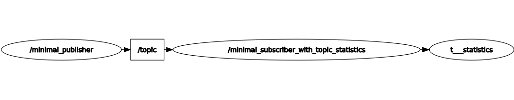

.. redirect-from::

    Topic-Statistics-Tutorial

ROS 2 Topic Statistics Tutorial (C++)
=====================================

**Goal:** Enable ROS 2 Topic Statistics and view the output statistics data

**Tutorial level:** Intermediate

**Time:** 10 minutes

.. contents:: Table of Contents
   :local:

Background
----------

This is a short tutorial of how to enable :ref:`Topic Statistics<AboutTopicStats>`
in ROS 2 and view the published statistics output using command line tools (:ref:`ros2topic<ROS2Topics>`).

ROS 2 provides the integrated measurement of statistics for messages received by any subscription,
called Topic Statistics.
With Topic Statistics enabled for your subscription, you can characterize the performance of your
system or use the data to help diagnose any present issues.

For more details please see the :ref:`Topic Statistics Concepts Page<AboutTopicStats>`.

Prerequisites
-------------

An installation from either binaries or source, where the version must be at least
`ROS2 Foxy <https://index.ros.org/doc/ros2/Releases/Release-Foxy-Fitzroy/>`__.
In previous tutorials, you learned how to :ref:`create a workspace <ROS2Workspace>`,
:ref:`create a package <CreatePkg>`, and create a :ref:`C++ <CppPubSub>` publisher and subscriber.

This tutorial assumes that you still have your ``cpp_pubsub`` package from the :ref:`C++ <CppPubSub>` tutorial.

Tasks
-----

1 Write the subscriber node with statistics enabled
^^^^^^^^^^^^^^^^^^^^^^^^^^^^^^^^^^^^^^^^^^^^^^^^^^^

Navigate into the ``dev_ws/src/cpp_pubsub/src`` folder, created in the previous tutorials, and
download the example talker code by entering the following command:

.. tabs::

   .. group-tab:: Linux

      .. code-block:: console

            wget -O member_function_with_topic_statistics.cpp https://raw.githubusercontent.com/ros2/examples/master/rclcpp/topics/minimal_subscriber/member_function_with_topic_statistics.cpp

   .. group-tab:: macOS

      .. code-block:: console

            wget -O member_function_with_topic_statistics.cpp https://raw.githubusercontent.com/ros2/examples/master/rclcpp/topics/minimal_subscriber/member_function_with_topic_statistics.cpp

   .. group-tab:: Windows

      Right click this link and select Save As ``publisher_member_function.cpp``:

      https://raw.githubusercontent.com/ros2/examples/master/rclcpp/topics/minimal_subscriber/member_function_with_topic_statistics.cpp

Now there will be a new file named ``member_function_with_topic_statistics.cpp``.
Open the file using your preferred text editor.

.. code-block:: C++

    #include <chrono>
    #include <memory>

    #include "rclcpp/rclcpp.hpp"
    #include "rclcpp/subscription_options.hpp"

    #include "std_msgs/msg/string.hpp"

    class MinimalSubscriberWithTopicStatistics : public rclcpp::Node
    {
    public:
      MinimalSubscriberWithTopicStatistics()
      : Node("minimal_subscriber_with_topic_statistics")
      {
        // manually enable topic statistics via options
        auto options = rclcpp::SubscriptionOptions();
        options.topic_stats_options.state = rclcpp::TopicStatisticsState::Enable;

        // configure the collection window and publish period (default 1s)
        options.topic_stats_options.publish_period = std::chrono::seconds(10);

        // configure the topic name (default '/statistics')
        // options.topic_stats_options.publish_topic = "/topic_statistics"

        auto callback = [this](std_msgs::msg::String::SharedPtr msg) {
            this->topic_callback(msg);
          };

        subscription_ = this->create_subscription<std_msgs::msg::String>(
          "topic", 10, callback, options);
      }

    private:
      void topic_callback(const std_msgs::msg::String::SharedPtr msg) const
      {
        RCLCPP_INFO(this->get_logger(), "I heard: '%s'", msg->data.c_str());
      }
      rclcpp::Subscription<std_msgs::msg::String>::SharedPtr subscription_;
    };

    int main(int argc, char * argv[])
    {
      rclcpp::init(argc, argv);
      rclcpp::spin(std::make_shared<MinimalSubscriberWithTopicStatistics>());
      rclcpp::shutdown();
      return 0;
    }

1.1 Examine the code
~~~~~~~~~~~~~~~~~~~~

As in the :ref:`C++ <CppPubSub>` tutorial, we have a subscriber node which receives string messages from the
``topic`` topic from the ``topic_callback`` function.
However, we've now added options to configure the subscription to enable topic statistics with
the ``rclcpp::SubscriptionOptions()`` options struct.

.. code-block:: C++

    // manually enable topic statistics via options
    auto options = rclcpp::SubscriptionOptions();
    options.topic_stats_options.state = rclcpp::TopicStatisticsState::Enable;

Optionally, fields such as the statistics collection/publish period and the topic used to publish
statistics can be configured as well.

.. code-block:: C++

    // configure the collection window and publish period (default 1s)
    options.topic_stats_options.publish_period = std::chrono::seconds(10);

    // configure the topic name (default '/statistics')
    // options.topic_stats_options.publish_topic = "/my_topic"

The configurable fields are described in the following table:

==================================  =============================================================================================
Subscription Config Field            Purpose
==================================  =============================================================================================
topic_stats_options.state            Enable or disable topic statistics (default ``rclcpp::TopicStatisticsState::Disable``)
topic_stats_options.publish_period   The period in which to collect statistics data and publish a statistics message (default ``1s``)
topic_stats_options.publish_topic    The topic to use when publishing statistics data (default ``/statistics``)
==================================  =============================================================================================

1.2 CMakeLists.txt
~~~~~~~~~~~~~~~~~~

Now open the ``CMakeLists.txt`` file.

Add the executable and name it ``listener_with_topic_statistics`` so you can run your node using ``ros2 run``:

.. code-block:: console

    add_executable(listener_with_topic_statistics member_function_with_topic_statistics.cpp)
    ament_target_dependencies(listener_with_topic_statistics rclcpp std_msgs)

    install(TARGETS
      talker
      listener
      listener_with_topic_statistics
      DESTINATION lib/${PROJECT_NAME})

Make sure to save the file, and then your pub/sub system, with topic statistics enabled,
should be ready for use.

2 Build and run
^^^^^^^^^^^^^^^

To build, see the :ref:`Build and run <cpppubsub-build-and-run>` section in the pub/sub tutorial.

Run the subscriber with statistics enabled node:

.. code-block:: console

     ros2 run cpp_pubsub listener_with_topic_statistics

Now run the talker node:

.. code-block:: console

     ros2 run cpp_pubsub talker

The terminal should start publishing info messages every 0.5 seconds, like so:

.. code-block:: console

    [INFO] [minimal_publisher]: Publishing: "Hello World: 0"
    [INFO] [minimal_publisher]: Publishing: "Hello World: 1"
    [INFO] [minimal_publisher]: Publishing: "Hello World: 2"
    [INFO] [minimal_publisher]: Publishing: "Hello World: 3"
    [INFO] [minimal_publisher]: Publishing: "Hello World: 4"

The listener will start printing messages to the console, starting at whatever message count the publisher is on at that time, like so:

.. code-block:: console

  [INFO] [minimal_subscriber_with_topic_statistics]: I heard: "Hello World: 10"
  [INFO] [minimal_subscriber_with_topic_statistics]: I heard: "Hello World: 11"
  [INFO] [minimal_subscriber_with_topic_statistics]: I heard: "Hello World: 12"
  [INFO] [minimal_subscriber_with_topic_statistics]: I heard: "Hello World: 13"
  [INFO] [minimal_subscriber_with_topic_statistics]: I heard: "Hello World: 14"

Now that the subscriber node is receiving messages, it will periodically publish statistics messages.
We will observe these messages in the next section.

3 Observe published statistic data
^^^^^^^^^^^^^^^^^^^^^^^^^^^^^^^^^^

While the nodes are running, open a new terminal window.
Execute the following command:

.. code-block:: console

    ros2 topic list

This will list all currently active topics.
You should see the following:

.. code-block:: console

    /parameter_events
    /rosout
    /statistics
    /topic

If you optionally changed the ``topic_stats_options.publish_topic`` field earlier in the tutorial,
then you will see that name instead of ``/statistics``.

The subscriber node you created is publishing statistics, for the topic ``topic``, to the output topic
``/statistics``.

We can visualize this using :ref:`RQt <RQt_Overview_Usage>`

Now we can view the statistics data published to this topic with the following command:

.. code-block:: console

    ros2 topic echo /statistics

The terminal should start publishing statistics messages every 10 seconds, because the
``topic_stats_options.publish_period`` subscription configuration was optionally changed earlier in the tutorial.

.. code-block:: console

    ---
    measurement_source_name: minimal_subscriber_with_topic_statistics
    metrics_source: message_age
    unit: ms
    window_start:
      sec: 1594856666
      nanosec: 931527366
    window_stop:
      sec: 1594856676
      nanosec: 930797670
    statistics:
    - data_type: 1
      data: .nan
    - data_type: 3
      data: .nan
    - data_type: 2
      data: .nan
    - data_type: 5
      data: 0.0
    - data_type: 4
      data: .nan
    ---
    measurement_source_name: minimal_subscriber_with_topic_statistics
    metrics_source: message_period
    unit: ms
    window_start:
      sec: 1594856666
      nanosec: 931527366
    window_stop:
      sec: 1594856676
      nanosec: 930797670
    statistics:
    - data_type: 1
      data: 499.2746365105009
    - data_type: 3
      data: 500.0
    - data_type: 2
      data: 499.0
    - data_type: 5
      data: 619.0
    - data_type: 4
      data: 0.4463309283488427
    ---

From the `message definition <https://github.com/ros2/rcl_interfaces/tree/master/statistics_msgs>`__
the ``data_types`` are as follows

===============    ===================
data_type value     statistics
===============    ===================
1                   average
2                   minimum
3                   maximum
4                   standard deviation
5                   sample count
===============    ===================

Here we see the two currently possible calculated statistics for the ``std_msgs::msg::String`` message published
to ``/topic`` by the ``minimal_publisher``.
Because the ``std_msgs::msg::String`` does not have a message header, the ``message_age`` calculation cannot be performed,
so NaNs are returned.
However, the ``message_period`` can be calculated and we see the statistics populated
in the message above.

Summary
-------

You created a subscriber node with topic statistics enabled, which published statistics data from
the :ref:`C++ <CppPubSub>`'s publisher node. You were able to compile and run this node. While running,
you were able to observe the statistics data.

Related content
---------------

To observe how the ``message_age`` period is calculated please see the
`ROS 2 Topic Statistisc demo <https://github.com/ros2/demos/tree/master/topic_statistics_demo>`__.
