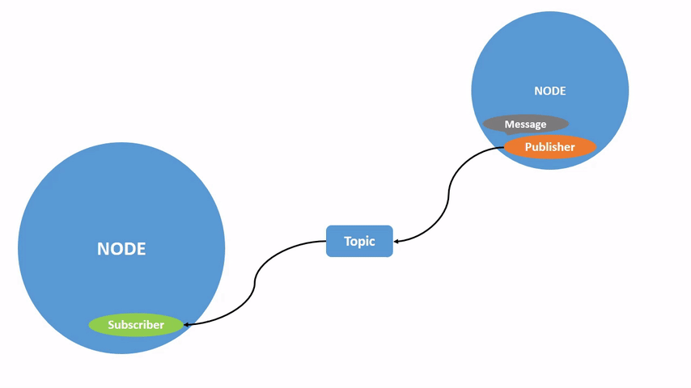
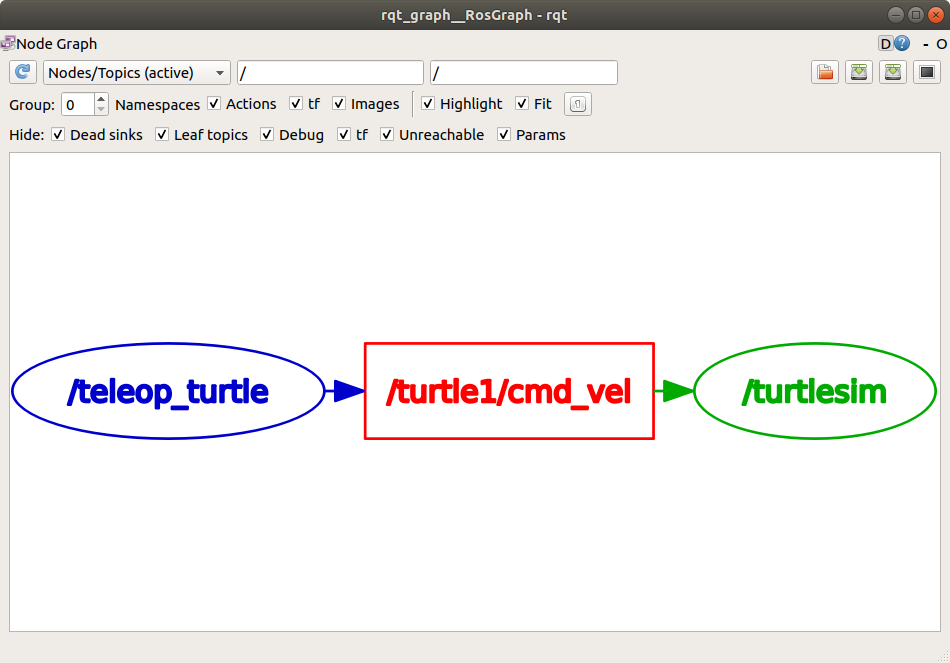
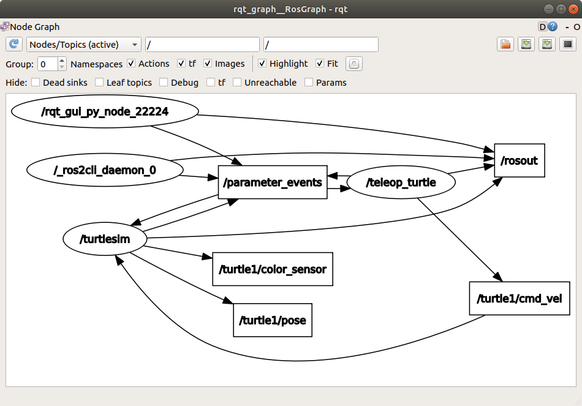
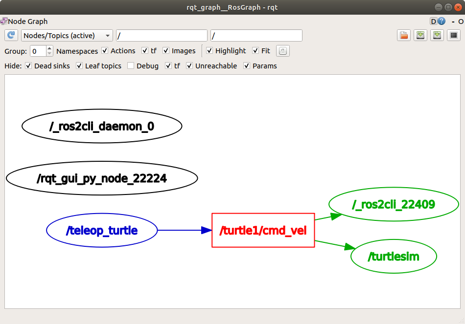
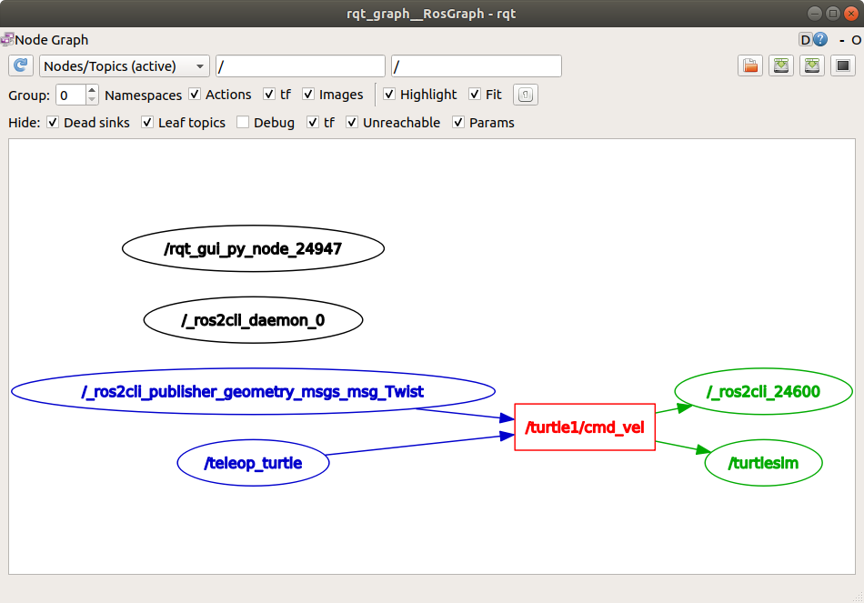
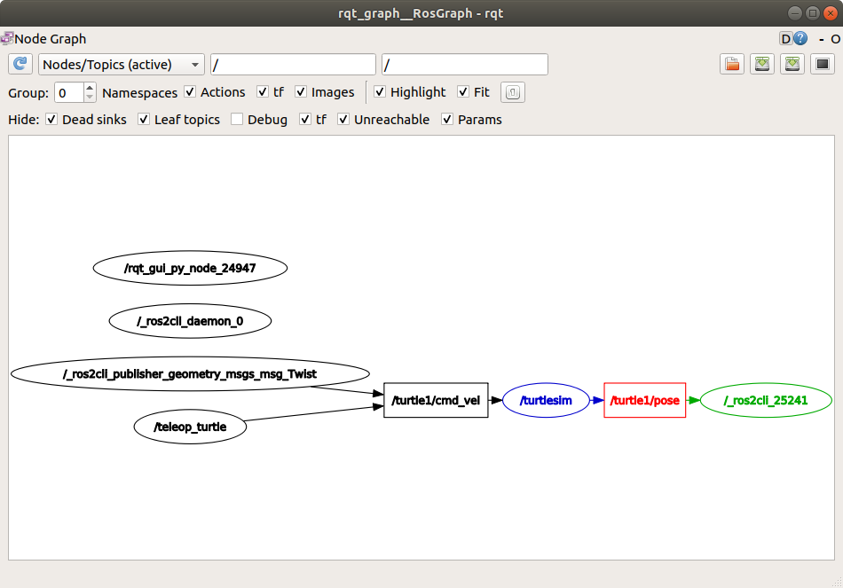

.. _ROS2Topics:

Understanding ROS 2 topics
==========================

**Goal:** Use rqt_graph and command line tools to introspect ROS 2 topics.

**Tutorial level:** Beginner

**Time:** 20 minutes

.. contents:: Contents
   :depth: 2
   :local:

Background
----------

ROS 2 breaks complex systems down into many modular nodes.
Topics are a vital element of the ROS graph that act as a bus for nodes to exchange messages.

A node may publish data to any number of topics and simultaneously have subscriptions to any number of topics.

.. image:: Topic-MultiplePublisherandMultipleSubscriber.gif

Topics are one of the important ways that data moves between nodes, and therefore between different parts of the system.

Prerequisites
-------------

The :ref:`previous tutorial <ROS2Nodes>` provides some useful background information on nodes that is built upon here.

As always, don’t forget to source ROS 2 in :ref:`every new terminal you open <ConfigROS2>`.

Tasks
-----

1 Setup
^^^^^^^

By now you should be comfortable starting up turtlesim.

Open a new terminal and run:

.. code-block:: console

    ros2 run turtlesim turtlesim_node

Open another terminal and run:

.. code-block:: console

    ros2 run turtlesim turtle_teleop_key

Recall from the previous tutorial that the names of these nodes are ``/turtlesim`` and ``/teleop_turtle`` by default.

2 rqt_graph
^^^^^^^^^^^

Throughout this tutorial, we will use ``rqt_graph`` to visualize the changing nodes and topics, as well as the connections between them.

The :ref:`turtlesim tutorial <Turtlesim>` tells you how to install rqt and all its plugins, including ``rqt_graph``.

To run rqt_graph, open a new terminal and enter the command:

.. code-block:: console

    rqt_graph

You can also open rqt_graph by opening rqt and selecting **Plugins** > **Introspection** > **Nodes Graph**.

You should see the above nodes and topic, as well as two actions around the periphery of the graph (let's ignore those for now).
If you hover your mouse over the topic in the center, you'll see the color highlighting like in the image above.

The graph is depicting how the ``/turtlesim`` node and the ``/teleop_turtle`` node are communicating with each other over a topic.
The ``/teleop_turtle`` node is publishing data (the keystrokes you enter to move the turtle around) to the ``/turtle1/cmd_vel`` topic, and the ``/turtlesim`` node is subscribed to that topic to receive the data.

The highlighting feature of rqt_graph is very helpful when examining more complex systems with many nodes and topics connected in many different ways.

rqt_graph is a graphical introspection tool.
Now we’ll look at some command line tools for introspecting topics.

3 ros2 topic list
^^^^^^^^^^^^^^^^^

Running the ``ros2 topic list`` command in a new terminal will return a list of all the topics currently active in the system:

.. code-block:: console

  /parameter_events
  /rosout
  /turtle1/cmd_vel
  /turtle1/color_sensor
  /turtle1/pose

``ros2 topic list -t`` will return the same list of topics, this time with the topic type appended in brackets after each:

.. code-block:: console

  /parameter_events [rcl_interfaces/msg/ParameterEvent]
  /rosout [rcl_interfaces/msg/Log]
  /turtle1/cmd_vel [geometry_msgs/msg/Twist]
  /turtle1/color_sensor [turtlesim/msg/Color]
  /turtle1/pose [turtlesim/msg/Pose]

Topics have names and types.
These attributes, particularly the type, are how nodes know they’re talking about the same information as it moves over topics.

If you’re wondering where all these topics are in rqt_graph, you can uncheck all the boxes under **Hide:**

For now, though, leave those options checked to avoid confusion.

4 ros2 topic echo
^^^^^^^^^^^^^^^^^

To see the data being published on a topic, use:

.. code-block:: console

    ros2 topic echo <topic_name>

Since we know that ``/teleop_turtle`` publishes data to ``/turtlesim`` over the ``/turtle1/cmd_vel`` topic, let's use ``echo`` to introspect on that topic:

.. code-block:: console

    ros2 topic echo /turtle1/cmd_vel

At first, this command won’t return any data.
That’s because it’s waiting for ``/teleop_turtle`` to publish something.

Return to the terminal where ``turtle_teleop_key`` is running and use the arrows to move the turtle around.
Watch the terminal where your ``echo`` is running at the same time, and you’ll see position data being published for every movement you make:

.. code-block:: console

  linear:
    x: 2.0
    y: 0.0
    z: 0.0
  angular:
    x: 0.0
    y: 0.0
    z: 0.0
    ---

Now return to rqt_graph and uncheck the **Debug** box.

``/_ros2cli_26646`` is the node created by the ``echo`` we just ran (the number will change).
Now you can see that the publisher is publishing data over the ``cmd_vel`` topic, and two subscribers are subscribed.

5 ros2 topic info
^^^^^^^^^^^^^^^^^

Topics don’t have to only be point-to-point communication; it can be one-to-many, many-to-one, or many-to-many.

Another way to look at this is running:

.. code-block:: console

    ros2 topic info /turtle1/cmd_vel

Which will return:

.. code-block:: console

  Type: geometry_msgs/msg/Twist
  Publisher count: 1
  Subscriber count: 2

6 ros2 interface show
^^^^^^^^^^^^^^^^^^^^^

Nodes send data over topics using messages.
Publishers and subscribers must send and receive the same type of message to communicate.

The topic types we saw earlier after running ``ros2 topic list -t`` let us know what type of messages each topic can send.
Recall that the ``cmd_vel`` topic has the type:

.. code-block:: console

    geometry_msgs/msg/Twist

This means that in the package ``geometry_msgs`` there is a ``msg`` called ``Twist``.

Now we can run ``ros2 interface show <type>.msg`` on this type to learn its the details, specifically, what structure of data the message expects.

.. code-block:: console

    ros2 interface show geometry_msgs/msg/Twist

.. code-block:: console

  # This expresses velocity in free space broken into its linear and angular parts.

      Vector3  linear
      Vector3  angular

This tells you that the ``/turtlesim`` node is expecting a message with two vectors, ``linear`` and ``angular``, of three elements each.
If you recall the data we saw ``/teleop_turtle`` passing to ``/turtlesim`` with the ``echo`` command, it’s in the same structure:

.. code-block:: console

  linear:
    x: 2.0
    y: 0.0
    z: 0.0
  angular:
    x: 0.0
    y: 0.0
    z: 0.0
    ---

7 ros2 topic pub
^^^^^^^^^^^^^^^^

Now that you have the message structure, you can publish data onto a topic directly from the command line using:

.. code-block:: console

    ros2 topic pub <topic_name> <msg_type> '<args>'

The ``'<args>'`` argument is the actual data you’ll pass to the topic, in the structure you just discovered in the previous section.

It’s important to note that this argument needs to be input in YAML syntax.
Input the full command like so:

.. code-block:: console

  ros2 topic pub --once /turtle1/cmd_vel geometry_msgs/msg/Twist "{linear: {x: 2.0, y: 0.0, z: 0.0}, angular: {x: 0.0, y: 0.0, z: 1.8}}"

``--once`` is an optional argument meaning “publish one message then exit”.

You will receive the following message in the terminal:

.. code-block:: console

  publisher: beginning loop
  publishing #1: geometry_msgs.msg.Twist(linear=geometry_msgs.msg.Vector3(x=2.0, y=0.0, z=0.0), angular=geometry_msgs.msg.Vector3(x=0.0, y=0.0, z=1.8))

And you will see your turtle move like so:

.. image:: pub_once.png

The turtle (and commonly the real robots which it is meant to emulate) require a steady stream of commands to operate continuously.
So, to get the turtle to keep moving, you can run:

.. code-block:: console

  ros2 topic pub --rate 1 /turtle1/cmd_vel geometry_msgs/msg/Twist "{linear: {x: 2.0, y: 0.0, z: 0.0}, angular: {x: 0.0, y: 0.0, z: 1.8}}"

The difference here is the removal of the ``--once`` option and the addition of the ``--rate 1`` option, which tells ``ros2 topic pub`` to publish the command in a steady stream at 1 Hz.

.. image:: pub_stream.png

You can refresh rqt_graph to see what’s happening graphically.
You will see the ``ros 2 topic pub ...`` node (``/_ros2cli_30358``) is publishing over the ``/turtle1/cmd_vel`` topic, and is being received by both the ``ros2 topic echo ...`` node (``/_ros2cli_26646``) and the ``/turtlesim`` node now.

Finally, you can run ``echo`` on the ``pose`` topic and recheck rqt_graph:

.. code-block:: console

  ros2 topic echo /turtle1/pose

In this case, ``/turtlesim`` is now publishing to the ``pose`` topic, and a new ``echo`` node is subscribed.

8 ros2 topic hz
^^^^^^^^^^^^^^^

For one last introspection on this process, you can report the rate at which data is published using:

.. code-block:: console

    ros2 topic hz /turtle1/pose

It will return data on the rate at which the ``/turtlesim`` node is publishing data to the ``pose`` topic.

.. code-block:: console

  average rate: 59.354
    min: 0.005s max: 0.027s std dev: 0.00284s window: 58

Recall that you set the rate of ``turtle1/cmd_vel`` to publish at a steady 1 Hz using ``ros2 topic pub --rate 1``.
If you run the above command with ``turtle1/cmd_vel`` instead of ``turtle1/pose``, you will see an average reflecting that rate.

.. 9 rqt_plot
   ^^^^^^^^^^
   Can't do this section now because there's some significant UI issues with rqt_plot for ROS 2

9 Clean up
^^^^^^^^^^

At this point you'll have a lot of nodes running.
Don’t forget to stop them, either by closing the terminal windows or entering ``Ctrl+C`` in each terminal.

Summary
-------

Nodes publish information over topics, which allows any number of other nodes to subscribe to and access that information.
In this tutorial you examined the connections between several nodes over topics using rqt_graph and command line tools.
You should now have a good idea of how data moves around a ROS 2 system.

Next steps
----------

Next you'll learn about another communication type in the ROS graph with the tutorial :ref:`ROS2Services`
