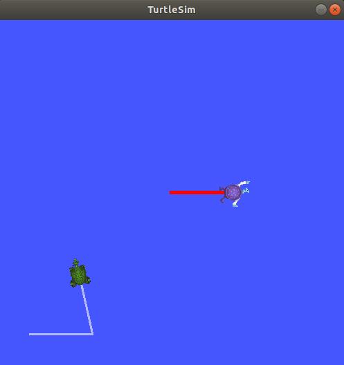

.. _Turtlesim2:

Introducing turtlesim and rqt
=============================

**Goal:** Install and use the turtlesim and rqt tools to prepare for upcoming tutorials.

**Tutorial level:** Beginner

**Time:** 15 minutes

.. contents:: Contents
   :depth: 2
   :local:

Background
----------

Turtlesim is a lightweight simulator for learning ROS 2.
It illustrates what ROS 2 does at the most basic level, to give you an idea of what you will do with a real robot or robot simulation later on.

rqt is a GUI tool for ROS 2.
Everything done in rqt can be done on the command line, but it provides an easier, more user-friendly way to manipulate ROS 2 elements.

This tutorial touches on core ROS 2 concepts, like the separation of nodes, topics, and services.
All of these concepts will be elaborated on in later tutorials; for now, you will simply set up the tools and get a feel for them.

Prerequisites
-------------

The previous tutorial, :ref:`ConfigROS2`, will show you how to set up your environment.

Tasks
-----

1 Install turtlesim
^^^^^^^^^^^^^^^^^^^

As always, start by sourcing your setup files, as described in the previous tutorial.

Install the turtlesim package for your ROS 2 distro:

.. tabs::

   .. group-tab:: Linux

      .. code-block:: bash

        sudo apt update

        sudo apt install ros-<distro>-turtlesim

   .. group-tab:: macOS

      As long as the archive you installed ROS 2 from contains the ``ros_tutorials`` repository, you should already have turtlesim installed.

   .. group-tab:: Windows

      As long as the archive you installed ROS 2 from contains the ``ros_tutorials`` repository, you should already have turtlesim installed.

Check that the package installed:

.. tabs::

   .. group-tab:: Linux

      .. code-block:: bash

        dpkg -l | grep ros-<distro>-turtlesim

   .. group-tab:: macOS

      ?

   .. group-tab:: Windows

      ?

2 Start turtlesim
^^^^^^^^^^^^^^^^^

To start turtlesim, enter the following command in your terminal:

.. code-block:: bash

  ros2 run turtlesim turtlesim_node

The simulator window should appear, with a random turtle in the center.

.. image:: turtlesim.png

The ``ros2 run`` command requires a package name (``turtlesim``), and a node name (``turtlesim_node``).

In the terminal under the command, you will see messages from the node:

.. code-block:: bash

  [INFO] [turtlesim]: Starting turtlesim with node name /turtlesim

  [INFO] [turtlesim]: Spawning turtle [turtle1] at x=[5.544445], y=[5.544445], theta=[0.000000]

Here you can see your default turtle’s name is ``turtle1``, and the default coordinates where it spawns.

3 Use turtlesim
^^^^^^^^^^^^^^^

Open a new terminal, or ideally a new tab in your terminal, and source ROS 2 again.

Now you will run a new node to control the turtle in the first node:

.. code-block:: bash

  ros2 run turtlesim turtle_teleop_key

Keep the terminal window active and use the arrow keys to move the turtle around in the simulator window.

.. note::

  Pressing an arrow key will only cause the turtle to move a short distance and then stop.
  This is because, realistically, you wouldn’t want a robot to continue carrying on an instruction without verification from the operator (you).

These are your two nodes, ``turtlesim`` and ``turtle_teleop_key``.
You can see the nodes and their associated services, topics, and actions using the ``list`` command:

.. code-block:: bash

  ros2 node list
  ros2 service list
  ros2 topic list
  ros2 action list

You will learn more about these concepts in the coming tutorials.
Normally, you would interact with services, topics, and actions using the command line.
Now, however, your only goal is to get a general overview of turtlesim.
So, we will use rqt, a graphical user interface for ROS 2, to look at services a little closer.

4 Install rqt
^^^^^^^^^^^^^

To install rqt:

.. tabs::

  .. group-tab:: Linux

    .. code-block:: bash

      sudo apt update

      sudo apt install ros-<distro>-rqt

  .. group-tab:: macOS

    As long as the archive you installed ROS 2 from contains the ``ros_visualization`` repository, you should already have rqt installed.

  .. group-tab:: Windows

    As long as the archive you installed ROS 2 from contains the ``ros_visualization`` repository, you should already have rqt installed.

To run rqt:

.. code-block:: bash

  rqt

5 Use rqt
^^^^^^^^^

After running rqt the first time, the window will be blank.
No worries; just select **Plugins** > **Services** > **Service Caller** from the menu bar at the top.

.. note::

  It may take some time for rqt to locate all the plugins itself.
  If you click on **Plugins**, but don’t see **Services** or any other options, you can wait (though it may take hours), or close rqt, enter the command ``rqt --force-discover`` in your terminal, then reopen rqt.

.. image:: rqt.png

Use the refresh button to the left of the **Service** dropdown list to make sure all the services of your turtlesim node are available.

5.1 Try the spawn service
~~~~~~~~~~~~~~~~~~~~~~~~~

Let’s use rqt to call the ``/spawn`` service.
You can guess from its name that ``/spawn`` will create another turtle in the turtlesim window.

Give the new turtle a unique name, like ``turtle2`` by double-clicking between the empty single quotes in the **Expression** column.
You can see that this expression corresponds to the **name** value, and is of type **string**.

Enter new coordinates for the turtle to spawn at, like ``x = 1.0`` and ``y = 1.0``.

.. image:: spawn.png

.. note::

  If you try to spawn a new turtle with the same name as an existing turtle, like your default ``turtle1``, you will get an error message in the terminal running ``turtlesim_node``:

  .. code-block:: bash

    [ERROR] [turtlesim]: A turtled named [turtle1] already exists

To spawn turtle2, you have to call the service by clicking the **Call** button on the upper right side of the rqt window.

You will see a new turtle (again with a random design) spawn at the coordinates you input for **x** and **y**.

If you refresh the service list in rqt, you will also see that now there are services related to the new turtle, ``/turtle2/…``, in addition to ``/turtle1/…``.

5.2 Try the set_pen service
~~~~~~~~~~~~~~~~~~~~~~~~~~~

Now let's give turtle1 a unique pen using the ``/set_pen`` service:

.. image:: set_pen.png

The values for **r**, **g** and **b**, between 0 and 255, will set the color of the pen turtle1 draws with, and **width** sets the thickness of the line.
Don't forget to call the service after updating the values.

If you return to the terminal where ``turtle_teleop_node`` is running and press the arrow keys, you will see turtle1’s pen has changed.

.. image:: new_pen.png

You've probably noticed that there's no way to move turtle2.
You can accomplish this by remapping turtle1's ``cmd_vel`` topic onto turtle2.

6 Remapping
^^^^^^^^^^^

In a new terminal, source ROS 2, and run:

.. code-block::

  ros2 run turtlesim turtle_teleop_key turtle1/cmd_vel:=turtle2/cmd_vel

Now you can move turtle2 when this terminal is active, and turtle1 when the other terminal running the ``turtle_teleop_key`` is active.

7 Close turtlesim
^^^^^^^^^^^^^^^^^

To stop the simulation, you can simply close the terminal windows where you ran ``turtlesim_node`` and ``turtle_teleop_key``.
If you want to keep those terminals open, but end the simulation, you can enter ``Ctrl``+``C`` in the ``turtlesim_node`` terminal, and ``q`` in the teleop terminal.

Summary
-------

Using turtlesim and rqt is a great way to learn the core concepts of ROS 2.
Now that you have turtlesim and rqt up and running, and an idea of how they work, you’ll be able to use them to expand on more complex ROS 2 concepts.

.. todo: "Next steps section" link to "Understanding ROS 2 nodes" once all tutorials are done (no empty references)
