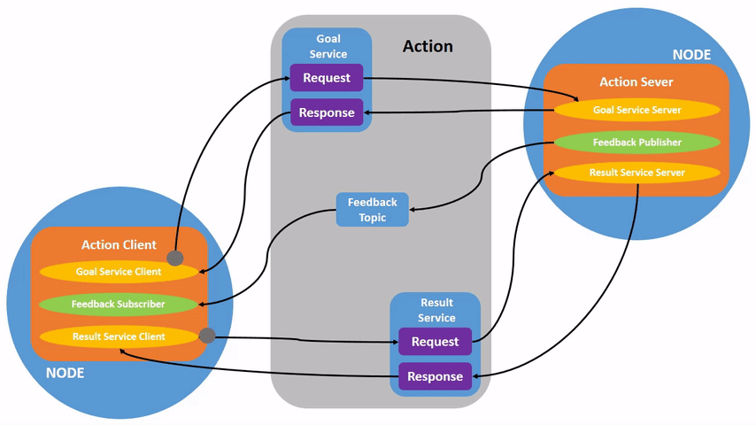

.. _ROS2Actions:

Understanding ROS 2 actions
===========================

**Goal:** Introspect actions in ROS 2.

**Tutorial level:** Beginner

**Time:** 15 minutes

.. contents:: Contents
   :depth: 2
   :local:

Background
----------

Actions are one of the communication types in ROS 2 intended for long running tasks.
They consist of three parts: a goal, a result, and feedback.

Actions are built on topics and services.
Their functionality is similar to services, except actions are preemptable (you can cancel them while executing).
They also provide steady feedback, as opposed to services which return a single response.

Actions use a client-server model, similar to the publisher-subscriber model (described in the :ref:`topics tutorial <ROS2Topics>`).
The “action client” node sends a goal to an “action server” node that acknowledges the goal and returns a stream of feedback and a result.

Prerequisites
-------------

This tutorial builds off concepts, like :ref:`nodes <ROS2Nodes>` and :ref:`topics <ROS2Topics>`, covered in previous tutorials.

This tutorial uses the :ref:`turtlesim package <Turtlesim>`.

As always, don’t forget to source ROS 2 in :ref:`every new terminal you open <ConfigROS2>`.

Tasks
-----

1 Setup
^^^^^^^

Start up the two turtlesim nodes, ``/turtlesim`` and ``/teleop_turtle``.

Open a new terminal and run:

.. code-block:: console

    ros2 run turtlesim turtlesim_node

Open another terminal and run:

.. code-block:: console

    ros2 run turtlesim turtle_teleop_key

2 Use actions
^^^^^^^^^^^^^

When you launch the ``/teleop_turtle`` node, you will see the following message in your terminal:

.. code-block:: console

    Use arrow keys to move the turtle.
    Use G|B|V|C|D|E|R|T keys to rotate to absolute orientations. 'F' to cancel a rotation.

Let’s focus on the second line, which corresponds to an action.
(The first instruction corresponds to the “cmd_vel” topic, discussed previously in the :ref:`topics tutorial <ROS2Topics>`.)

Notice that the letter keys ``G|B|V|C|D|E|R|T`` form a “box” around the ``F`` key on your keyboard.
Each key’s position around ``F`` corresponds to that orientation in turtlesim.
For example, the ``E`` will rotate the turtle’s orientation to the upper left corner.

Pay attention to the terminal where the ``/turtlesim`` node is running.
Each time you press one of these keys, you are sending a goal to an action server that is part of the ``/turtlesim`` node.
The goal is to rotate the turtle to face a particular direction.
A message relaying the result of the goal should display once the turtle completes its rotation:

.. code-block:: console

    [INFO] [turtlesim]: Rotation goal completed successfully

The ``F`` key will cancel a goal mid-execution, demonstrating the preemptable feature of actions.

Try pressing the ``C`` key, and then pressing the ``F`` key before the turtle can complete its rotation.
In the terminal where the ``/turtlesim`` node is running, you will see the message:

.. code-block:: console

  [INFO] [turtlesim]: Rotation goal canceled

Not only can the client-side (your input in the teleop) preempt goals, but the server-side (the ``/turtlesim`` node) can as well.
When the server-side preempts an action, it “aborts” the goal.

Try hitting the ``D`` key, then the ``G`` key before the first rotation can complete.
In the terminal where the ``/turtlesim`` node is running, you will see the message:

.. code-block:: console

  [WARN] [turtlesim]: Rotation goal received before a previous goal finished. Aborting previous goal

The server-side aborted the first goal because it was interrupted.

3 ros2 node info
^^^^^^^^^^^^^^^^

To see the ``/turtlesim`` node’s actions, open a new terminal and run the command:

.. code-block:: console

    ros2 node info /turtlesim

Which will return a list of ``/turtlesim``’s subscribers, publishers, services, action servers and action clients:

.. code-block:: console

  /turtlesim
    Subscribers:
      /parameter_events: rcl_interfaces/msg/ParameterEvent
      /turtle1/cmd_vel: geometry_msgs/msg/Twist
    Publishers:
      /parameter_events: rcl_interfaces/msg/ParameterEvent
      /rosout: rcl_interfaces/msg/Log
      /turtle1/color_sensor: turtlesim/msg/Color
      /turtle1/pose: turtlesim/msg/Pose
    Services:
      /clear: std_srvs/srv/Empty
      /kill: turtlesim/srv/Kill
      /reset: std_srvs/srv/Empty
      /spawn: turtlesim/srv/Spawn
      /turtle1/set_pen: turtlesim/srv/SetPen
      /turtle1/teleport_absolute: turtlesim/srv/TeleportAbsolute
      /turtle1/teleport_relative: turtlesim/srv/TeleportRelative
      /turtlesim/describe_parameters: rcl_interfaces/srv/DescribeParameters
      /turtlesim/get_parameter_types: rcl_interfaces/srv/GetParameterTypes
      /turtlesim/get_parameters: rcl_interfaces/srv/GetParameters
      /turtlesim/list_parameters: rcl_interfaces/srv/ListParameters
      /turtlesim/set_parameters: rcl_interfaces/srv/SetParameters
      /turtlesim/set_parameters_atomically: rcl_interfaces/srv/SetParametersAtomically
    Action Servers:
      /turtle1/rotate_absolute: turtlesim/action/RotateAbsolute
    Action Clients:

Notice that the ``/turtle1/rotate_absolute`` action for ``/turtlesim`` is under ``Action Servers``.
This means ``/turtlesim`` responds to and provides feedback for the ``/turtle1/rotate_absolute`` action.

The ``/teleop_turtle`` node has the name ``/turtle1/rotate_absolute`` under ``Action Clients`` meaning that it sends goals for that action name.

.. code-block:: console

    ros2 node info /teleop_turtle

Which will return:

.. code-block:: console

  /teleop_turtle
    Subscribers:
      /parameter_events: rcl_interfaces/msg/ParameterEvent
    Publishers:
      /parameter_events: rcl_interfaces/msg/ParameterEvent
      /rosout: rcl_interfaces/msg/Log
      /turtle1/cmd_vel: geometry_msgs/msg/Twist
    Services:
      /teleop_turtle/describe_parameters: rcl_interfaces/srv/DescribeParameters
      /teleop_turtle/get_parameter_types: rcl_interfaces/srv/GetParameterTypes
      /teleop_turtle/get_parameters: rcl_interfaces/srv/GetParameters
      /teleop_turtle/list_parameters: rcl_interfaces/srv/ListParameters
      /teleop_turtle/set_parameters: rcl_interfaces/srv/SetParameters
      /teleop_turtle/set_parameters_atomically: rcl_interfaces/srv/SetParametersAtomically
    Action Servers:

    Action Clients:
      /turtle1/rotate_absolute: turtlesim/action/RotateAbsolute

4 ros2 action list
^^^^^^^^^^^^^^^^^^

To identify all the actions in the ROS graph, run the command:

.. code-block:: console

    ros2 action list

Which will return:

.. code-block:: console

    /turtle1/rotate_absolute

This is the only action in the ROS graph right now.
It controls the turtle’s rotation, as you saw earlier.
You also already know that there is one action client (part of ``/teleop_turtle``) and one action server (part of ``/turtlesim``) for this action from using the ``ros2 node info <node_name>`` command.

4.1 ros2 action list -t
~~~~~~~~~~~~~~~~~~~~~~~

Actions have types, similar to topics and services.
To find ``/turtle1/rotate_absolute``'s type, run the command:

.. code-block:: console

    ros2 action list -t

Which will return:

.. code-block:: console

    /turtle1/rotate_absolute [turtlesim/action/RotateAbsolute]

In brackets to the right of each action name (in this case only ``/turtle1/rotate_absolute``) is the action type, ``turtlesim/action/RotateAbsolute``.
You will need this when you want to execute an action from the command line or from code.

5 ros2 action info
^^^^^^^^^^^^^^^^^^

You can further introspect the ``/turtle1/rotate_absolute`` action with the command:

.. code-block:: console

    ros2 action info /turtle1/rotate_absolute

Which will return

.. code-block:: console

  Action: /turtle1/rotate_absolute
  Action clients: 1
      /teleop_turtle
  Action servers: 1
      /turtlesim

This tells us what we learned earlier from running ``ros2 node info`` on each node:
The ``/teleop_turtle`` node has an action client and the ``/turtlesim`` node has an action server for the ``/turtle1/rotate_absolute`` action.

6 ros2 interface show
^^^^^^^^^^^^^^^^^^^^^

One more piece of information you will need before sending or executing an action goal yourself is the structure of the action type.

Recall that you identified ``/turtle1/rotate_absolute``’s type when running the command ``ros2 action list -t``.
Enter the following command with the action type in your terminal:

.. code-block:: console

  ros2 interface show turtlesim/action/RotateAbsolute.action

Which will return:

.. code-block:: console

  # The desired heading in radians
  float32 theta
  ---
  # The angular displacement in radians to the starting position
  float32 delta
  ---
  # The remaining rotation in radians
  float32 remaining

The first section of this message, above the ``---``, is the structure (data type and name) of the goal request.
The next section is the structure of the result.
The last section is the structure of the feedback.

7 ros2 action send_goal
^^^^^^^^^^^^^^^^^^^^^^^

Now let’s send an action goal from the command line with the following syntax:

.. code-block:: console

    ros2 action send_goal <action_name> <action_type> <values>

``<values>`` need to be in YAML format.

Keep an eye on the turtlesim window, and enter the following command into your terminal:

.. code-block:: console

    ros2 action send_goal /turtle1/rotate_absolute turtlesim/action/RotateAbsolute "{theta: 1.57}"

You should see the turtle rotating, as well as the following message in your terminal:

.. code-block:: console

  Waiting for an action server to become available...
  Sending goal:
     theta: 1.57

  Goal accepted with ID: f8db8f44410849eaa93d3feb747dd444

  Result:
    delta: -1.568000316619873

  Goal finished with status: SUCCEEDED

All goals have a unique ID, shown in the return message.
You can also see the result, a field with the name ``delta``, which is the displacement to the starting position.

To see the feedback of this goal, add ``--feedback`` to the last command you ran.
First, make sure you change the value of ``theta``.
After running the previous command, the turtle will already be at the orientation of ``1.57`` radians, so it won’t move unless you pass a new ``theta``.

.. code-block:: console

    ros2 action send_goal /turtle1/rotate_absolute turtlesim/action/RotateAbsolute "{theta: -1.57}" --feedback

Your terminal will return the message:

.. code-block:: console

  Sending goal:
     theta: -1.57

  Goal accepted with ID: e6092c831f994afda92f0086f220da27

  Feedback:
    remaining: -3.1268222332000732

  Feedback:
    remaining: -3.1108222007751465

  …

  Result:
    delta: 3.1200008392333984

  Goal finished with status: SUCCEEDED

You will continue to receive feedback, the remaining radians, until the goal is complete.

Summary
-------

Actions are like services that allow you to execute long running tasks, provide regular feedback, and are cancelable.

A robot system would likely use actions for navigation.
An action goal could tell a robot to travel to a position.
While the robot navigates to the position, it can send updates along the way (i.e. feedback), and then a final result message once it's reached its destination.

Turtlesim has an action server that action clients can send goals to for rotating turtles.
In this tutorial, you introspected that action, ``/turtle1/rotate_absolute``, to get a better idea of what actions are and how they work.

Next steps
----------

Now you've covered all of the core ROS 2 concepts.
The last few tutorials in the "Users" set will introduce you to some tools and techniques that will make using ROS 2 easier, starting with :ref:`rqt_console`.

Related content
---------------

You can read more about the design decisions behind actions in ROS 2 `here <https://design.ros2.org/articles/actions.html>`__.
