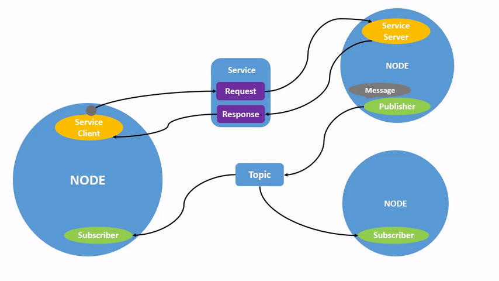

.. _ROS2Nodes:

Understanding ROS 2 nodes
=========================

**Goal:** Learn about the function of nodes in ROS 2, and the tools to interact with them.

**Tutorial level:** Beginner

**Time:** 10 minutes

.. contents:: Contents
   :depth: 2
   :local:

Background
----------

1 The ROS 2 graph
^^^^^^^^^^^^^^^^^

Over the next few tutorials, you will learn about a series of core ROS 2 concepts that make up what is referred to as the “ROS (2) graph”.

The ROS graph is a network of ROS 2 elements processing data together at one time.
It encompasses all executables and the connections between them if you were to map them all out and visualize them.

2 Nodes in ROS 2
^^^^^^^^^^^^^^^^

Each node in ROS should be responsible for a single, module purpose (e.g. one node for controlling wheel motors, one node for controlling a laser range-finder, etc).
Each node can send and receive data to other nodes via topics, services, actions, or parameters.

A full robotic system is comprised of many nodes working in concert.
In ROS 2, a single executable (C++ program, Python program, etc.) can contain one or more nodes.

Prerequisites
-------------

The :ref:`previous tutorial <Turtlesim>` shows you how to install the ``turtlesim`` package used here.

As always, don’t forget to source ROS 2 in :ref:`every new terminal you open <ConfigROS2>`.

Tasks
-----

1 ros2 run
^^^^^^^^^^

The command ``ros2 run`` launches an executable from a package.

.. code-block:: console

    ros2 run <package_name> <executable_name>

To run turtlesim, open a new terminal, and enter the following command:

.. code-block:: console

    ros2 run turtlesim turtlesim_node

The turtlesim window will open, as you saw in the previous tutorial.

Here, the package name is ``turtlesim`` and the executable name is ``turtlesim_node``.

We still don’t know the node name, however.
You can find node names by using ``ros2 node list``

2 ros2 node list
^^^^^^^^^^^^^^^^

``ros2 node list`` will show you the names of all running nodes.
This is especially useful when you want to interact with a node, or when you have a system running many nodes and need to keep track of them.

Open a new terminal while turtlesim is still running in the other one, and enter the following command:

.. code-block:: console

    ros2 node list

The terminal will return the node name:

.. code-block:: console

  /turtlesim

Open another new terminal and start the teleop node with the command:

.. code-block:: console

    ros2 run turtlesim turtle_teleop_key

Here, we are searching the ``turtlesim`` package again, this time for the executable named ``turtle_teleop_key``.

Return to the terminal where you ran ``ros2 node list`` and run it again.
You will now see the names of two active nodes:

.. code-block:: console

  /turtlesim
  /teleop_turtle

2.1 Remapping
~~~~~~~~~~~~~

`Remapping <https://design.ros2.org/articles/ros_command_line_arguments.html#name-remapping-rules>`__ allows you to reassign default node properties, like node name, topic names, service names, etc., to custom values.
In the last tutorial, you used remapping on ``turtle_teleop_key`` to change the default turtle being controlled.

Now, lets reassign the name of our ``/turtlesim`` node.
In a new terminal, run the following command:

.. code-block:: console

  ros2 run turtlesim turtlesim_node --ros-args --remap __node:=my_turtle

Since you’re calling ``ros2 run`` on turtlesim again, another turtlesim window will open.
However, now if you return to the terminal where you ran ``ros2 node list``, and run it again, you will see three node names:

.. code-block:: console

    /turtlesim
    /teleop_turtle
    /my_turtle

3 ros2 node info
^^^^^^^^^^^^^^^^

Now that you know the names of your nodes, you can access more information about them with:

.. code-block:: console

    ros2 node info <node_name>

To examine your latest node, ``my_turtle``, run the following command:

.. code-block:: console

    ros2 node info /my_turtle

``ros2 node info`` returns a list of subscribers, publishers, services, and actions (the ROS graph connections) that interact with that node.
The output should look like this:

.. code-block:: console

  /my_turtle
    Subscribers:
      /parameter_events: rcl_interfaces/msg/ParameterEvent
      /turtle1/cmd_vel: geometry_msgs/msg/Twist
    Publishers:
      /parameter_events: rcl_interfaces/msg/ParameterEvent
      /rosout: rcl_interfaces/msg/Log
      /turtle1/color_sensor: turtlesim/msg/Color
      /turtle1/pose: turtlesim/msg/Pose
    Services:
      /clear: std_srvs/srv/Empty
      /kill: turtlesim/srv/Kill
      /reset: std_srvs/srv/Empty
      /spawn: turtlesim/srv/Spawn
      /turtle1/set_pen: turtlesim/srv/SetPen
      /turtle1/teleport_absolute: turtlesim/srv/TeleportAbsolute
      /turtle1/teleport_relative: turtlesim/srv/TeleportRelative
      /my_turtle/describe_parameters: rcl_interfaces/srv/DescribeParameters
      /my_turtle/get_parameter_types: rcl_interfaces/srv/GetParameterTypes
      /my_turtle/get_parameters: rcl_interfaces/srv/GetParameters
      /my_turtle/list_parameters: rcl_interfaces/srv/ListParameters
      /my_turtle/set_parameters: rcl_interfaces/srv/SetParameters
      /my_turtle/set_parameters_atomically: rcl_interfaces/srv/SetParametersAtomically
    Action Servers:
      /turtle1/rotate_absolute: turtlesim/action/RotateAbsolute
    Action Clients:

Now try running the same command on the ``/teleop_turtle`` node, and see how its connections differ from ``my_turtle``.

You will learn more about ROS graph connection concepts in the upcoming tutorials.

Summary
-------

A node is a fundamental ROS 2 element that serves a single, modular purpose in a robotics system.

In this tutorial, you utilized nodes created from the ``turtlesim`` package by running the executables ``turtlesim_node`` and ``turtle_teleop_key``.

You learned how to use ``ros2 node list`` to discover active node names and ``ros2 node info`` to introspect on a single node.
These tools are vital to understanding the flow of data in a complex, real-world robot system.

Next steps
----------

Now that you understand nodes in ROS 2, you can move on to the :ref:`topics tutorial <ROS2Topics>`.
Topics are one of the communication types that connects nodes.

Related content
---------------

The :ref:`ConceptsHome` page adds some more detail to the concept of nodes.
