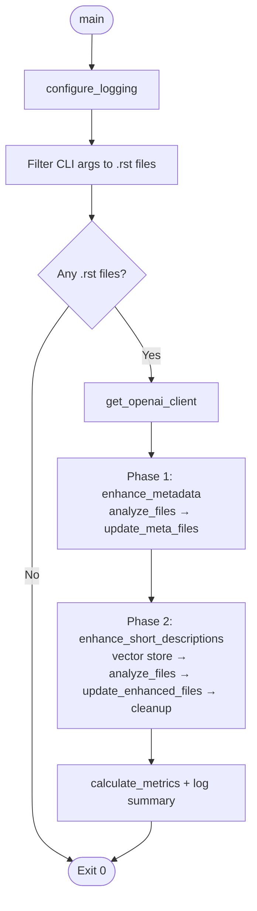
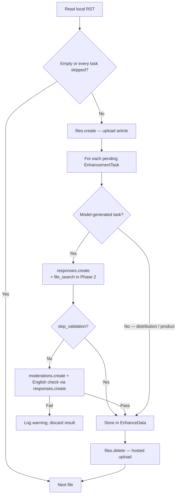
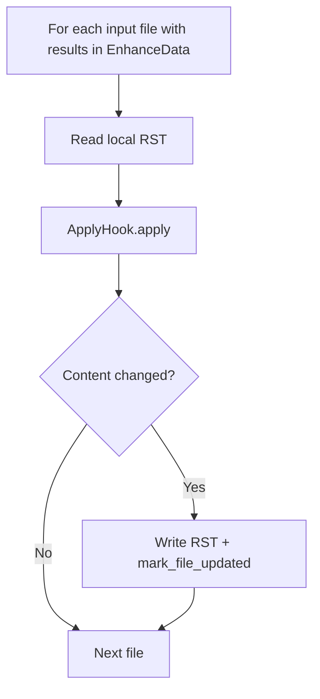

# Enhancement Tools

This directory contains a command-line tool designed to automatically enhance the ROS documentation (`.rst` files) with metadata and descriptive content, using Sphinx directives.

## Overview

The primary tool (`enhance_topics.py`) uses OpenAI models and APIs to analyse articles and inject:
1.  **SEO Metadata**: `description`, `keywords`, `distribution`, and `product` fields within a `.. meta::` directive. The first two are model-generated; `distribution` and `product` are fixed placeholders (`{DISTRO}` and `{PRODUCT}`) for substitution by the Sphinx build.
2.  **Short Descriptions**: A concise descriptive paragraph injected into the custom `.. short-description::` directive, using Retrieval-Augmented Generation (RAG) to match the style required by the information model.

Both model-generated metadata (`description`, `keywords`) and short descriptions are produced via OpenAI's **Responses API**, with the article uploaded through the **Files API**. Short descriptions additionally attach a vector store for `file_search` over example articles.

## Code layout

| Module | Role |
|--------|------|
| `enhance_topics.py` | CLI entry point, orchestration, `EnhancementTask` / `ApplyHook`, metadata analysis (`analyze_content`), and shared `analyze_files` / validation |
| `openai_retrieval.py` | Vector-store setup, short description Responses calls (`analyze_with_responses`), and cleanup of hosted retrieval resources |
| `enhance_data.py` | `EnhanceData` accumulator, per-file results, and metrics |
| `rst_utils.py` | Regex-based read/write of `.. meta::` and `.. short-description::` in RST source |
| `config.py` | Model name, timeouts, retries, prompts, and example paths for RAG (leaf module; no imports from sibling scripts) |

## Orchestration Logic

The execution follows a top-to-bottom flow through several key layers:

### 1. Entry Point: `main()`
The execution starts in the `main()` function, which handles the high-level setup:
- **Logging**: Configures standard logging and silences noisy HTTP libraries (`httpx`, `httpcore`).
- **Argument Parsing**: Collects file paths from the command line and filters for `.rst` files.
- **Client Setup**: Initialises the `OpenAI` client by loading the API key from environment variables or a `.env` file in the repository root.
- **Orchestration**: Executes the two main enhancement phases: `enhance_metadata()` and `enhance_short_descriptions()`.
- **Metrics**: Calculates and logs a summary of how many files were processed, how many had valid results, and how many were actually updated.

### 2. Phase 1: Metadata Enhancement (`enhance_metadata`)
This phase focuses on the `.. meta::` block:
- **Task Definition**: Creates four `EnhancementTask` objects—`description` and `keywords` (model-generated via prompts), and `distribution` and `product` (fixed values `{DISTRO}` and `{PRODUCT}` with no API call).
- **Skip Logic**: Each task includes a `should_skip` check that reads the file content to see if that metadata field name already exists in the `.. meta::` block.
- **Analysis**: Calls `analyze_files()`, which uploads the file to OpenAI and runs analysis. Model-generated fields use the Responses API (`analyze_content`); fixed fields return their placeholder values and skip content validation.
- **Application**: Calls `update_meta_files()`, which uses the `MetadataApplyHook` to merge the new metadata into the existing (or new) `.. meta::` block in the RST file.

### 3. Phase 2: Short Description Enhancement (`enhance_short_descriptions`)
This phase uses Retrieval-Augmented Generation (RAG), implemented in `openai_retrieval.py`:
- **Vector Store Setup**: Uploads a set of "gold standard" example RST files to an OpenAI Vector Store. This allows the model to "search" for examples of good short descriptions to match the project's style.
- **Task Definition**: Creates a task for `short-description`.
- **Skip Logic**: Skips if the file already has a non-empty `.. short-description::` body (an empty directive is still enhanced).
- **Analysis**: Calls `analyze_files()`, where the analysis function (`analyze_with_responses`) includes the `vector_store_id` to enable the file search capability.
- **Application**: Uses the `ShortDescriptionApplyHook` to inject the generated text into the file.
- **Cleanup**: A `finally` block ensures the temporary vector store and hosted files are deleted from OpenAI.

### 4. Core Processing Engines

#### `analyze_files`
This is the central engine for interacting with the AI:
1. **File Upload**: Uploads the target RST file to OpenAI's Files API.
2. **Task Execution**: For every task that isn't skipped:
   - Calls the task's `analyze` function (metadata and short-description analysers use `tenacity` retries on transient API errors).
   - **Validation**: If a result is returned, runs `validate_content()` (moderation and English-language checks) unless the task sets `skip_validation` (fixed metadata placeholders).
3. **Storage**: Valid results are stored in an `EnhanceData` object (`enhance_data.py`).
4. **Cleanup**: Deletes the uploaded file from OpenAI.

#### `update_enhanced_files`
This handles the file I/O and content modification:
1. **Hook Application**: Passes the file content and the AI results to an `ApplyHook` (either `MetadataApplyHook` or `ShortDescriptionApplyHook`).
2. **Regex Injection**: The hooks use utility functions (from `rst_utils.py`) to perform precise regex-based injection of the new content.
3. **Persistence**: If the content has changed, it overwrites the file and marks it as "updated" in the metrics.

### 5. Key Abstractions
- **`EnhancementTask`**: Bundles the "what" (key), "when to skip" (logic), and "how to analyse" (API call or fixed value). Defined in `enhance_topics.py`.
- **`ApplyHook`**: A strategy pattern for defining how different types of AI results should be written back to the RST format (`MetadataApplyHook`, `ShortDescriptionApplyHook`).
- **`EnhanceData`**: Immutable state object (in `enhance_data.py`) that carries analysis results, updated-file tracking, and metrics through both enhancement phases.

## Workflow Diagrams

Each enhancement phase is a **two-pass** pipeline: `analyze_files` (upload, generate, validate, store in `EnhanceData`) then `update_enhanced_files` / `update_meta_files` (read local RST, apply hook, write only if changed). Disk writes never occur inside `analyze_files`.

### High-Level Orchestration


### Per File: Analysis Pass (`analyze_files`)
Runs inside both phases (once per file per phase). Phase 2 also creates the example vector store once before this loop and deletes it in `finally` after the apply pass.



### Per Phase: Apply Pass (`update_enhanced_files`)
Runs after all files in that phase have been analysed. Regex injection is via `rst_utils` inside the `ApplyHook`.



### Analysis Pass (sequence)
```mermaid
sequenceDiagram
    participant S as analyze_files
    participant L as Local RST
    participant O as OpenAI API

    S->>L: Read content
    Note over S: Skip file if empty or all tasks' should_skip is true
    S->>O: files.create (purpose=user_data)
    loop Each pending EnhancementTask
        alt description, keywords, or short-description
            S->>O: responses.create (file_search in Phase 2)
            O-->>S: Generated text
            opt validate_content (not for fixed meta)
                S->>O: moderations.create
                S->>O: responses.create (English yes/no check)
            end
            alt Passes validation or skip_validation
                S->>S: add_analysis_result → EnhanceData
            else Failed or empty result
                S->>S: Log warning; do not store
            end
        else distribution or product
            S->>S: Fixed placeholder (no API call)
            S->>S: add_analysis_result → EnhanceData
        end
    end
    S->>O: files.delete (uploaded article)
    Note over S,L: RST on disk unchanged until apply pass
```
